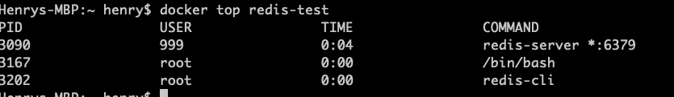

使用docker的目的


使用场景


**什么是镜像**？  
Docker 包括三个基本概念
* 镜像（Image）
* 容器（Container）
* 仓库（Repository）

**Docker 容器**

docker 使用容器来运行
- docker 不用root命令


## 镜像
- docker 启动CentOS  
`docker run -t -i centos  /bin/bash`

## Docker 命令
- 查看版本  
`docker --version`

- 查看所有容器  
`$ docker ps -a`

- 后台运行  
通过加参数d  
`docker run -itd --name ubuntu-test ubuntu /bin/bash`
- 进入容器  
推荐使用exec，容器不会退出
    - docekr attach
    - docker exec  
    `docker exec -it redis-test /bin/bash` 在一个已经启动的容器里运行bash进程 
- 删除容器  
`docker rm name`  
- Docker inspect 命令  
`docker inspect centos`

- 查看日志  
`docker logs -tf --tail 10 redis-test`
- 查看进程  
`docker top redis-test`

- 启动具体进程  
`docker exec centos nginx`
    ```shell
    Henrys-MBP:~ henry$ docker exec centos nginx
    Henrys-MBP:~ henry$ docker centos top
    docker: 'centos' is not a docker command.
    See 'docker --help'
    Henrys-MBP:~ henry$ docker top 29
    PID                 USER                TIME                COMMAND
    6448                root                0:00                /bin/bash
    6537                root                0:00                nginx: master process nginx
    6538                998                 0:00                nginx: worker process
    6539                998                 0:00                nginx: worker process
    6540                998                 0:00                nginx: worker process
    6541                998                 0:00                nginx: worker process
    6542                998                 0:00                nginx: worker process
    6543                998                 0:00                nginx: worker process

    ```
## Docker 实例
### docker 安装 Redis  
`docker pull redis:latest`

#### 运行
`docker run -itd --name redis-test -p 6379:6379 redis`

#### 安装成功
