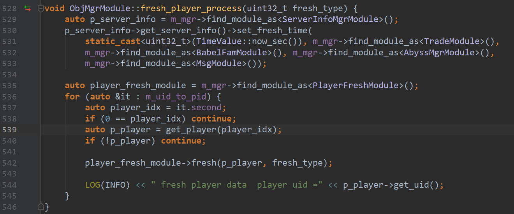
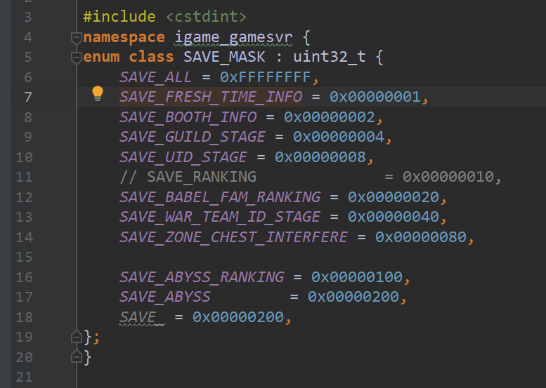

<!-- TOC -->

- [1. 天师学院](#1-%E5%A4%A9%E5%B8%88%E5%AD%A6%E9%99%A2)
  - [1.1. 通知](#11-%E9%80%9A%E7%9F%A5)
- [2. ObjMgrModule](#2-objmgrmodule)
  - [2.1. 刷新玩家数据集](#21-%E5%88%B7%E6%96%B0%E7%8E%A9%E5%AE%B6%E6%95%B0%E6%8D%AE%E9%9B%86)
  - [2.2. 在线玩家](#22-%E5%9C%A8%E7%BA%BF%E7%8E%A9%E5%AE%B6)
- [3. server 全局信息](#3-server-%E5%85%A8%E5%B1%80%E4%BF%A1%E6%81%AF)
- [4. 战队](#4-%E6%88%98%E9%98%9F)
  - [4.1. get](#41-get)
  - [4.2. 邀请](#42-%E9%82%80%E8%AF%B7)
  - [4.3. Get](#43-get)
- [5. 好友](#5-%E5%A5%BD%E5%8F%8B)
  - [5.1. get](#51-get)
- [6. Object](#6-object)
  - [6.1. get player instance](#61-get-player-instance)
- [7. Team](#7-team)
  - [7.1. team 邀请](#71-team-%E9%82%80%E8%AF%B7)
- [8. 装备](#8-%E8%A3%85%E5%A4%87)
  - [8.1. 资源](#81-%E8%B5%84%E6%BA%90)
- [9. 辅助功能](#9-%E8%BE%85%E5%8A%A9%E5%8A%9F%E8%83%BD)
  - [9.1. 配置](#91-%E9%85%8D%E7%BD%AE)
  - [9.2. Gm](#92-gm)
- [10. 深渊](#10-%E6%B7%B1%E6%B8%8A)
- [11. Ranking](#11-ranking)
- [12. 数据同步步](#12-%E6%95%B0%E6%8D%AE%E5%90%8C%E6%AD%A5%E6%AD%A5)
- [13. 数据库](#13-%E6%95%B0%E6%8D%AE%E5%BA%93)
  - [13.1. datasvr](#131-datasvr)
- [14. 任务](#14-%E4%BB%BB%E5%8A%A1)
  - [14.1 update](#141-update)
  - [14.4 finish](#144-finish)
  - [14.5 save](#145-save)
  - [14.6 open](#146-open)
  - [14.7](#147)
- [15. notice](#15-notice)
- [16. temp](#16-temp)

<!-- /TOC -->

# 1. 天师学院
- 多久保存一下数据?
```c++
void PublicDataMgrModule::save_role_pub_data(
    Player *player, Database::RolePublicData *role_pub_data) {
    auto role_pub = get_role_public_data(player->get_uid());
    // CHECK(role_pub) << "role_pub is null";
    if(role_pub){
        role_pub->pack_role_pub_data(role_pub_data);
        role_pub->set_save(SAVE_FLAG::PUB_SAVE_FLAG_NO_NEED);
    }
}
```
- player  
  - function  
  `on_load_all_role_pub_data `  
  
事件
```cpp
leave_team_timer = new CallbackObject();
    leave_team_timer->set_handler(std::bind(&TeamModule::on_player_leave_timer, this, _1, _2));
    leave_team_timer->set_name("TeamModule::on_player_leave_timer");
```
清理内存  
`EVENT_PLAYER_MEM_DEL = 25, //玩家从内存清除事件`

直接使用event事件
```cpp
m_mgr->find_module_as<EventModule>()->post_event_start_active(
                    static_cast<uint32_t>(p_activetime_data->id()),
                    static_cast<uint32_t>(p_activetime_data->playingid()));
```


## 1.1. 通知
```cpp
void NoticeMgrModule::new_notice_to_player(Player *p_player, _CreateNewNotice _create_new_notice,
    CREATE_ITEM_VEC *create_item_vec, CREATE_NOTICE_PLAYER_VEC *create_notice_player_vec) {
    LOG(INFO) << " new_item_notify_to_player playing_type = " << _create_new_notice.playing_type()
              << "event_id = " << _create_new_notice.event_id()
              << "p1 = " << _create_new_notice.param1() << "p2 = " << _create_new_notice.param2()
              << "p3 = " << _create_new_notice.param3() << "p4 = " << _create_new_notice.param4()
              << "p5 = " << _create_new_notice.param5() << "p6 = " << _create_new_notice.param6();
    if (create_item_vec)
        // 有道具展示的 跑马灯
        _item_notice(p_player, _create_new_notice, create_item_vec);
    else
        // 没有道具展示的 跑马灯
        _notice(p_player, _create_new_notice, create_notice_player_vec);
}
```

# 2. ObjMgrModule
## 2.1. 刷新玩家数据集
`void fresh_player_process(uint32_t fresh_type); // 刷新玩家数据集`


## 2.2. 在线玩家
auto player_online_map = m_p_obj_module->get_online_playerlist();

# 3. server 全局信息



# 4. 战队
## 4.1. get
```cpp
auto pub = m_public_module->get_role_public_data(player->get_uid());
        if (!pub) return;
        auto war_team = m_war_team_base_data_module->get_public_war_team(pub->war_team_id());
```

## 4.2. 邀请
on_client_war_team_quick_invite_req
## 4.3. Get
```cpp
 auto pub = m_public_module->get_role_public_data(uid);
    if (!pub) return;
    auto war_team = m_war_team_base_data_module->get_public_war_team(pub->war_team_id());  
    if (!war_team) return;
```

战队列表请求
`on_client_war_team_list_info_req`


auto _average_level = average_level(p_data);

PublicWarTeamWordModule::get_uid_sys_recommend

# 5. 好友
  `void send_operate_friend_req_to_db(
         uint64_t uid, uint64_t friend_id, uint32_t operate_type, uint32_t tabs_id = 0);`

```cpp
MyFriendStruct &my_friend = player->get_my_friend_data();
        if(my_friend.is_blacklist(uid)){
            m_p_msg_module->send_to_connsvr(player, ProtoCs::WarTeamQuickInviteRes::default_instance(),
                                            ProtoCs::CsWarTeamCmd::RET_TEAM_MEMBER_IS_BLACK_LIST);
            return 0;
        }

        auto p_player = m_p_obj_module->find_player_ptr_by_uid(send_uid);
        if (!p_player) return;

        Player *p_player = get->uid();
```

## 5.1. get
`   MyFriendStruct &my_friend = player->get_my_friend_data();
`

    MyFriendStruct &my_friend = player->get_my_friend_data();

```cpp
if (my_friend.is_blacklist(uid)) 

MyFriendStruct &my_friend = p_player->get_my_friend_data();
    if(my_friend.is_blacklist(inviteed_uid)){
        m_p_msg_module->send_to_connsvr(p_player, ProtoCs::WarTeamQuickInviteRes::default_instance(),
                                        ProtoCs::CsWarTeamCmd::RET_TEAM_MEMBER_IS_BLACK_LIST);
        return 0;
    }

```


# 6. Object 
## 6.1. get player instance
auto p_player = m_p_obj_module->find_player_ptr_by_uid(send_uid);
    if (!p_player) return;


# 7. Team
## 7.1. team 邀请
`invite_join_team`


# 8. 装备
```cpp
 auto itc = ret_map.find(static_cast<const unsigned int &>(p_break_config->stoneid(i)));
            if (itc != ret_map.end())
                itc->second += p_break_config->stonenum(i);
            else
                ret_map.insert(
                    std::make_pair(p_break_config->stoneid(i), p_break_config->stonenum(i)));
            break;
```

## 8.1. 资源


  
# 9. 辅助功能
## 9.1. 配置
 CsCommCmd cs_comm_cmd = 0x01;
 RET_BLACK_LIST = 0X00010015;  //对方拒绝接受你的消息【飘字】


`get_deploy_data_by_key_enum` 取配置文件数据

get_deploy_data_row_enum 获取具体行的数据

## 9.2. Gm
lazy_get_all_commands

# 10. 深渊
AbyssMgrModule::abyss_fight_call_back

# 11. Ranking
 _generate_abyss_ranking

# 12. 数据同步步
 sync_data

# 13. 数据库

## 13.1. datasvr

send_to_datasvr

SELECT *  FROM role_info_0 WHERE role_name like '一璐有你';


 uint32_t new_id = m_p_server_info_module->get_server_info()->get_war_team_id(
            m_mgr->find_module_as<TradeModule>(), m_mgr->find_module_as<BabelFamModule>(),
            m_mgr->find_module_as<AbyssMgrModule>(), m_p_msg_module);
        LOG(INFO) << " create_new_war_team id = " << new_id;

        PlayerExpBufferNtf

# 14. 任务

TaskDataMap
check_task_complete
PersonalNewTask 

SingleNewTaskNode


## 14.1 update
add_new_task

PersonalNewTask::create_new_role


TaskMgrModule::task_receive_award_req


PersonalNewTask::load_new_task_by_db


## 14.4 finish
MissionMgrModule::task_complete_sub

## 14.5 save
PersonalNewTask::save_new_task

## 14.6 open
MissionMgrModule::update_task_open

## 14.7  
```cpp
void PersonalNewTask::create_new_role(DeployModule *deploy_module) {
    auto task_array = deploy_module->get_deploy_data_array<deploy::TaskBaseArray>(
        static_cast<uint32_t>(to_underlying(DeployId::TaskBase)));
    for (int32_t i = 0; i < task_array->items_size(); i++) {
        auto p_task_data = deploy_module->get_deploy_data_by_key_enum<deploy::TaskBase>(
            DeployId::TaskBase, task_array->items(i).id());
        if (!p_task_data) continue;
        if (p_task_data->maintype() != ProtoComm::NewTaskMainType::NTMT_SINGLE) continue;
        if (!add_new_task(p_task_data->id(), p_task_data)) {
            LOG(INFO) << "create_new_role add_new_task failed";
        }
    }
}

```


 uint32 monthly_task_id = 7;  //monthlyTask表id
    uint32 monthly_week_id = 8; // monthlyTask表weekid


    auto task_week_array = m_deploy_module->get_deploy_data_array<deploy::MonthlyTaskArray>(
                static_cast<uint32_t>(to_underlying(DeployId::MonthlyTask)));
        if(!task_week_array){
            LOG(ERROR) << "MonthlyTaskMgrModule::_refresh_task_data  task_week_array is null";
            return;
        }
        
        for (int32_t i = 0; i < task_week_array->items_size(); ++i) {
            player->get_personal_new_task_info().refresh_next_week_task(task_week_array->items(i).id(), id_v);
            m_p_mission_mgr_module->ntf_mission_info(player, id_v);
        }


m_timer_start = new CallbackObject();
    m_timer_start->set_handler(std::bind(&AbyssMgrModule::on_abyss_tick_timer, this, _1, _2));
    m_timer_start->set_name("AbyssMgrModule::on_abyss_tick_timer");

    if (m_timer_module->register_timer(TimeValue(1), TimeValue(1), m_timer_start, nullptr) == -1) {
        LOG(ERROR) << "AbyssMgrModule register on_abyss_tick_timer error!";
    }


# 15. notice
```cpp

m_p_notice_mgr_module = m_mgr->find_module_as<NoticeMgrModule>();

class NoticeMgrModule;


 m_p_notice_mgr_module->new_notice_to_player(p_player,
            _CreateNewNotice(ProtoComm::PlayingType::PT_TLDS,
                ProtoComm::SysNoticeType::SYS_NOTICE_TYPE_NULL, p_player->get_uid()),
            &create_item_vec);

 #include "module/notice_mgr/create_new_notice.h"
#include "module/notice_mgr/notice_mgr_module.h"   


    std::string war_name ="";
                    if(p_public->war_team_id() != 0){
                        m_war_team_base_data_module->get_war_team_name(p_public->war_team_id(),war_name);

//公告
    m_p_notice_mgr_module->new_notice_to_player(p_player,
        _CreateNewNotice(ProtoComm::PlayingType::PT_SLC,
            ProtoComm::SysNoticeType::SYS_NOTICE_TYPE_NULL, p_player->get_uid()),
        &ret_vec);


```

# 16. temp


import "cs_activity.proto";
CsActivityCmd cs_activity_cmd = 0x30;

 void get_member_uid(std::vector<uint64_t> &player_uid);

 for (auto &i : player_uid_vec) {
        if (i == uid) continue;
        auto p_player = m_p_obj_module->find_player_ptr_by_uid(i);
        if (!p_player) continue;


        get_single_diamond_num

        addition_package_flag

```sql
SELECT MAX(server_max_player_level) AS max_level FROM server_info_0;

SELECT MAX(LEVEL) AS max_level  FROM role_info_0;
-- 手动查表
UPDATE server_info_1 SET server_max_player_level = ;

SELECT MAX(server_max_player_level) AS max_level FROM server_info_1;

SELECT MAX(LEVEL) AS max_level  FROM role_info_1;


UPDATE server_info_1 SET server_max_player_level = ;
```

```sql

   SELECT GREATEST((SELECT MAX(LEVEL) 
                   FROM role_info_0),
                (SELECT MAX(LEVEL) 
                   FROM role_info_1))
```

SELECT LEVEL FROM role_info_0
UNION ALL
SELECT LEVEL FROM role_info_1
ORDER BY LEVEL DESC;


  