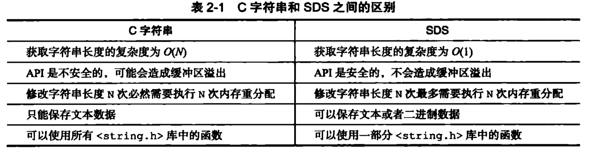
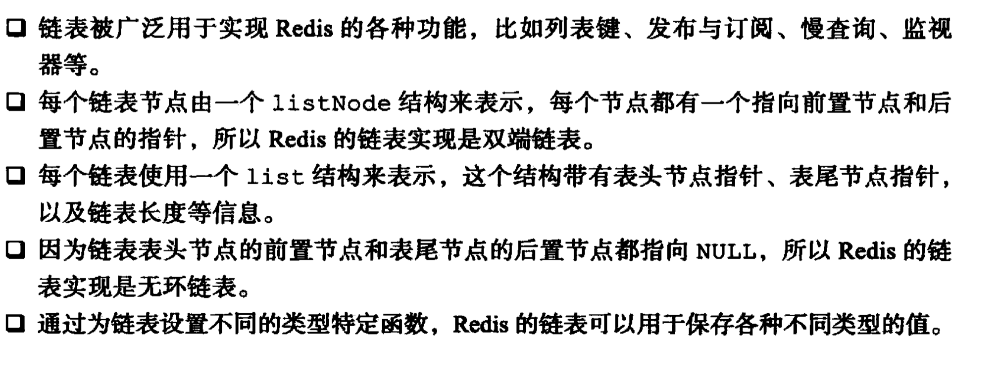
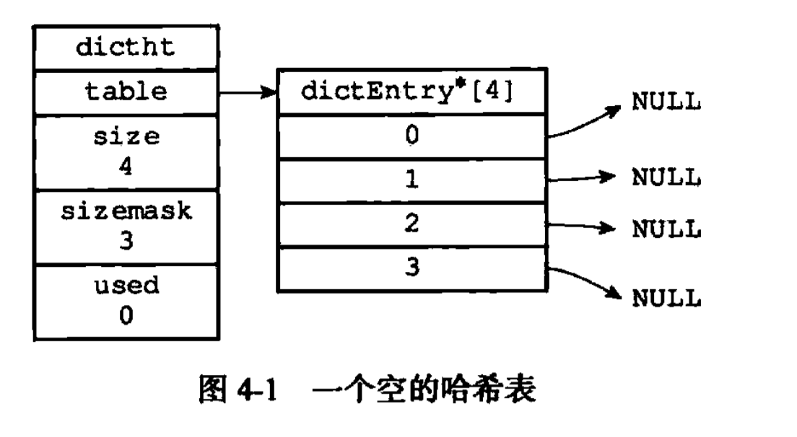

### 简单动态字符串	



**Sds 的优点**：

1. 常数获取字符串长度
2. 避免缓冲区溢出
3. 减少修改字符串长度的内存分配次数
4. 二进制安全

## 链表

双端链表结构

```c
/*
 * 双端链表结构
 */
typedef struct list {
    // 表头节点
    listNode *head;
    // 表尾节点
    listNode *tail;
    // 节点值复制
    void *(*dup)(void *ptr);
    // 节点值释放
    void (*free)(void *ptr);
    // 节点值比较函数
    int (*match)(void *ptr, void *key);
    unsigned long len;
} list;
```

Many fuction implement by list. 



## 字典

### Hash table	

Dict is an implementation of a non-blocking hash table which rehashes incrementally.

```c
typedef struct dict {
    dictEntry **table;
    dictType *type;
    unsigned long size;
    unsigned long sizemask;
    unsigned long used;
    void *privdata;
} dict;
```



Hash  table node.

```c
typedef struct dictIterator {
    dict *ht;
    int index;
    dictEntry *entry, *nextEntry;
} dictIterator;
```

### Hash collision

Redis 的哈希表使用链地址法（separate chaining）来解决键冲突： 每个哈希表节点都有一个 `next` 指针， 多个哈希表节点可以用 `next` 指针构成一个单向链表， 被分配到同一个索引上的多个节点可以用这个单向链表连接起来， 这就解决了键冲突的问题。

> **Solution 1: Store data of different modules in different Redis instances**
>
> **Solution 2: Store data of different modules in different databases of a single Redis instance**
>
> **Solution 3: Create namespace with key prefix**

[How to namespace keys on redis to avoid name collisions?](https://stackoverflow.com/questions/39192469/how-to-namespace-keys-on-redis-to-avoid-name-collisions) 

```c
typedef struct dict {
    dictType *type;
    void *privdata;
    // hashtable first use ht[0]，when rehash use ht[1]
    dictht ht[2];
    long rehashidx; /* rehashing not in progress if rehashidx == -1 */
    unsigned long iterators; /* number of iterators currently running */
} dict;
```

 Redis usually stores data in the first `dictht` instance ( `ht[0]` ). While rehashing, it creates an expanded hash table of size power of 2 just greater than or equal to the current hash table ( `ht[0]` ) size and the new hash table is actually stored in `ht[1]` instance.


### Redis rehash

Redis 对字典的哈希表执行 rehash 的步骤如下：

1. 为字典的 `ht[1]` 哈希表分配空间， 这个哈希表的空间大小取决于要执行的操作， 以及 `ht[0]`

    当前包含的键值对数量 （也即是`ht[0].used` 属性的值）：

   - 如果执行的是扩展操作， 那么 `ht[1]` 的大小为第一个大于等于 `ht[0].used * 2` 的  （`2` 的 `n` 次方幂）；
   - 如果执行的是收缩操作， 那么 `ht[1]` 的大小为第一个大于等于 `ht[0].used` 的  。

2. 将保存在 `ht[0]` 中的所有键值对 rehash 到 `ht[1]` 上面： rehash 指的是重新计算键的哈希值和索引值， 然后将键值对放置到 `ht[1]` 哈希表的指定位置上。

3. 当 `ht[0]` 包含的所有键值对都迁移到了 `ht[1]` 之后 （`ht[0]` 变为空表）， 释放 `ht[0]` ， 将 `ht[1]` 设置为 `ht[0]` ， 并在 `ht[1]` 新创建一个空白哈希表， 为下一次 rehash 做准备。

hash factor, `load_factor = ht[0].used / ht[0].size`.

### 渐进式 rehash 

因为在进行渐进式 rehash 的过程中， 字典会同时使用 `ht[0]` 和 `ht[1]` 两个哈希表， 所以在渐进式 rehash 进行期间， 字典的删除（delete）、查找（find）、更新（update）等操作会在两个哈希表上进行： 比如说， 要在字典里面查找一个键的话， 程序会先在 `ht[0]` 里面进行查找， 如果没找到的话， 就会继续到 `ht[1]` 里面进行查找.

### Hash function 

Hash function is [MurmurHash2](https://github.com/aappleby/smhasher/blob/master/src/MurmurHash2.cpp), It was created by Austin Appleby in 2008[[2\]](https://en.wikipedia.org/wiki/MurmurHash#cite_note-2) and is currently hosted on GitHub along with its test suite named 'SMHasher'.

Redis conclude

## Skiplist

 This skiplist implementation is almost a C translation of the original

  algorithm described by William Pugh in "Skip Lists: A Probabilistic

  Alternative to Balanced Trees", modified in three ways:

 	 a) this implementation allows for repeated scores.

​	  b) the comparison is not just by key (our 'score') but by satellite data.

 	 c) there is a back pointer, so it's a doubly linked list with the back

   pointers being only at "level 1". This allows to traverse the list

  from tail to head, useful for ZREVRANGE. 

Here are have a paper about skiplist,[Skip Lists: A Probabilistic Alternative to Balanced Trees](ftp://ftp.cs.umd.edu/pub/skipLists/skiplists.pdf)

### zskiplistNode

```c
typedef struct zskiplistNode {
    sds ele;
    double score;
    struct zskiplistNode *backward;
    struct zskiplistLevel {
        struct zskiplistNode *forward;
        unsigned long span;
    } level[];
} zskiplistNode;
```


- 层（level）：节点中用 `L1` 、 `L2` 、 `L3` 等字样标记节点的各个层， `L1` 代表第一层， `L2` 代表第二层，以此类推。每个层都带有两个属性：前进指针和跨度。前进指针用于访问位于表尾方向的其他节点，而跨度则记录了前进指针所指向节点和当前节点的距离。在上面的图片中，连线上带有数字的箭头就代表前进指针，而那个数字就是跨度。当程序从表头向表尾进行遍历时，访问会沿着层的前进指针进行。
- 后退（backward）指针：节点中用 `BW` 字样标记节点的后退指针，它指向位于当前节点的前一个节点。后退指针在程序从表尾向表头遍历时使用。
- 分值（score）：各个节点中的 `1.0` 、 `2.0` 和 `3.0` 是节点所保存的分值。在跳跃表中，节点按各自所保存的分值从小到大排列。
- 成员对象（obj）：各个节点中的 `o1` 、 `o2` 和 `o3` 是节点所保存的成员对象。

### skiplist summary

- ZSETs use a specialized version of Skiplists.
- ZSKIPLIST_MAXLEVEL 32 /* Should be enough for 2^64 elements */ 
- 跳跃表中的节点按照分值大小进行排序， 当分值相同时， 节点按照成员对象的大小进行排序


## Redis Integer

### Redis 整数集合的实现

```c
typedef struct intset {
    uint32_t encoding;
    uint32_t length;
    int8_t contents[];
} intset;
```

整数集合（intset）是 Redis 用于保存整数值的集合抽象数据结构， 它可以保存类型为 `int16_t` 、 `int32_t` 或者 `int64_t` 的整数值， 并且保证集合中不会出现重复元素。

### Redis 升级的好处

整数集合的升级策略有两个好处， 一个是提升整数集合的灵活性， 另一个是尽可能地节约内存。

### Summary

- 整数集合是集合键的底层实现之一。
- 整数集合的底层实现为数组， 这个数组以有序、无重复的方式保存集合元素， 在有需要时， 程序会根据新添加元素的类型， 改变这个数组的类型。
- 升级操作为整数集合带来了操作上的灵活性， 并且尽可能地节约了内存。
- 整数集合只支持升级操作， 不支持降级操作。

## Ziplist

压缩列表（ziplist）是列表键和哈希键的底层实现之一。

```shell
127.0.0.1:6379> RPUSH lst 1 3 5 10086 "hello" "world"
(integer) 6
127.0.0.1:6379> type lst
list
127.0.0.1:6379> OBJECT encoding lst
"quicklist"
127.0.0.1:6379>
```


```shell
127.0.0.1:6379> HMSET profile "name" "henry" "age" 24 "lover" "cyw"
OK
127.0.0.1:6379> OBJECT profile
(error) ERR Unknown subcommand or wrong number of arguments for 'profile'. Try OBJECT HELP.
127.0.0.1:6379> OBJECT encoding profile
"ziplist"
127.0.0.1:6379>
```

### Summary

- 压缩列表是一种为节约内存而开发的顺序型数据结构。
- 压缩列表被用作列表键和哈希键的底层实现之一。
- 压缩列表可以包含多个节点，每个节点可以保存一个字节数组或者整数值。
- 添加新节点到压缩列表， 或者从压缩列表中删除节点， 可能会引发连锁更新操作， 但这种操作出现的几率并不高

## Redis object implementation 

Some kind of objects like Strings and Hashes can be  internally represented in multiple ways. The 'encoding' field of the object is set to one of this fields for this object. 

```c
#define OBJ_ENCODING_RAW 0     /* Raw representation */
#define OBJ_ENCODING_INT 1     /* Encoded as integer */
#define OBJ_ENCODING_HT 2      /* Encoded as hash table */
#define OBJ_ENCODING_ZIPMAP 3  /* Encoded as zipmap */
#define OBJ_ENCODING_LINKEDLIST 4 /* No longer used: old list encoding. */
#define OBJ_ENCODING_ZIPLIST 5 /* Encoded as ziplist */
#define OBJ_ENCODING_INTSET 6  /* Encoded as intset */
#define OBJ_ENCODING_SKIPLIST 7  /* Encoded as skiplist */
#define OBJ_ENCODING_EMBSTR 8  /* Embedded sds string encoding */
#define OBJ_ENCODING_QUICKLIST 9 /* Encoded as linked list of ziplists */
#define OBJ_ENCODING_STREAM 10 /* Encoded as a radix tree of listpacks */
```

Redis 可以在执行命令之前， 根据对象的类型来判断一个对象是否可以执行给定的命令。 使用对象的另一个好处是， 我们可以针对不同的使用场景， 为对象设置多种不同的数据结构实现， 从而优化对象在不同场景下的使用效率。

除此之外， Redis 的对象系统还实现了基于引用计数技术的内存回收机制： 当程序不再使用某个对象的时候， 这个对象所占用的内存就会被自动释放； 另外， Redis 还通过引用计数技术实现了对象共享机制， 这一机制可以在适当的条件下， 通过让多个数据库键共享同一个对象来节约内存。

```c
 typedef struct redisObject {

       unsigned type:4;

       unsigned encoding:4;

       unsigned lru:LRU_BITS; /* lru time (relative to server.lruclock) */

       int refcount;

       void *ptr;

    } robj;
```

As you can see in the client structure above, arguments in a command are described as `robj` structures. The following is the full `robj` structure, which defines a **Redis object**, Basically this structure can represent all the basic  Redis data types like strings, lists, sets, sorted sets and so forth. The interesting thing is that it has a `type` field, so that it is possible to know what type a given object has, and a `refcount`, so that the same object can be referenced in multiple places without allocating it multiple times. Finally the `ptr`  field points to the actual representation of the object, which might vary even for the same type, depending on the `encoding` used.

[Objects encoding](https://github.com/henrytien/redis/blob/unstable/src/server.h#L581) 

| 编码常量                    | 编码所对应的底层数据结构      |
| --------------------------- | ----------------------------- |
| `REDIS_ENCODING_INT`        | `long` 类型的整数             |
| `REDIS_ENCODING_EMBSTR`     | `embstr` 编码的简单动态字符串 |
| `REDIS_ENCODING_RAW`        | 简单动态字符串                |
| `REDIS_ENCODING_HT`         | 字典                          |
| `REDIS_ENCODING_LINKEDLIST` | 双端链表                      |
| `REDIS_ENCODING_ZIPLIST`    | 压缩列表                      |
| `REDIS_ENCODING_INTSET`     | 整数集合                      |
| `REDIS_ENCODING_SKIPLIST`   | 跳跃表和字典                  |

"ENCODING <key> -- Return the kind of internal representation used in order to store the value associated with a key.",

"FREQ <key> -- Return the access frequency index of the key. The returned integer is proportional to the logarithm of the recent access frequency of the key.",

"IDLETIME <key> -- Return the idle time of the key, that is the approximated number of seconds elapsed since the last access to the key.",

"REFCOUNT <key> -- Return the number of references of the value associated with the specified key.",

### Embstr 

如果字符串对象保存的是一个字符串值， 并且这个字符串值的长度小于等于 `39` 字节， 那么字符串对象将使用 `embstr` 编码的方式来保存这个字符串值。

`embstr` 编码是专门用于保存短字符串的一种优化编码方式， 这种编码和 `raw` 编码一样， 都使用 `redisObject` 结构和 `sdshdr` 结构来表示字符串对象， 但 `raw` 编码会调用两次内存分配函数来分别创建 `redisObject` 结构和 `sdshdr` 结构， 而 `embstr` 编码则通过调用一次内存分配函数来分配一块连续的空间， 空间中依次包含 `redisObject` 和 `sdshdr` 两个结构

The current limit of 44 is chosen so that the biggest string object

 we allocate as EMBSTR will still fit into the 64 byte arena of jemalloc. 

\#define OBJ_ENCODING_EMBSTR_SIZE_LIMIT 44

### Raw 

我们通过 APPEND 命令， 向一个保存整数值的字符串对象追加了一个字符串值， 因为追加操作只能对字符串值执行， 所以程序会先将之前保存的整数值 `10086` 转换为字符串值 `"10086"` ， 然后再执行追加操作， 操作的执行结果就是一个 `raw` 编码的、保存了字符串值的字符串对象.


| 命令        | `int` 编码的实现方法                                         | `embstr` 编码的实现方法                                      | `raw` 编码的实现方法                                         |
| ----------- | ------------------------------------------------------------ | ------------------------------------------------------------ | ------------------------------------------------------------ |
| SET         | 使用 `int` 编码保存值。                                      | 使用 `embstr` 编码保存值。                                   | 使用 `raw` 编码保存值。                                      |
| GET         | 拷贝对象所保存的整数值， 将这个拷贝转换成字符串值， 然后向客户端返回这个字符串值。 | 直接向客户端返回字符串值。                                   | 直接向客户端返回字符串值。                                   |
| APPEND      | 将对象转换成 `raw` 编码， 然后按`raw` 编码的方式执行此操作。 | 将对象转换成 `raw` 编码， 然后按`raw` 编码的方式执行此操作。 | 调用 `sdscatlen` 函数， 将给定字符串追加到现有字符串的末尾。 |
| INCRBYFLOAT | 取出整数值并将其转换成 `longdouble` 类型的浮点数， 对这个浮点数进行加法计算， 然后将得出的浮点数结果保存起来。 | 取出字符串值并尝试将其转换成`long double` 类型的浮点数， 对这个浮点数进行加法计算， 然后将得出的浮点数结果保存起来。 如果字符串值不能被转换成浮点数， 那么向客户端返回一个错误。 | 取出字符串值并尝试将其转换成 `longdouble` 类型的浮点数， 对这个浮点数进行加法计算， 然后将得出的浮点数结果保存起来。 如果字符串值不能被转换成浮点数， 那么向客户端返回一个错误。 |
| INCRBY      | 对整数值进行加法计算， 得出的计算结果会作为整数被保存起来。  | `embstr` 编码不能执行此命令， 向客户端返回一个错误。         | `raw` 编码不能执行此命令， 向客户端返回一个错误。            |
| DECRBY      | 对整数值进行减法计算， 得出的计算结果会作为整数被保存起来。  | `embstr` 编码不能执行此命令， 向客户端返回一个错误。         | `raw` 编码不能执行此命令， 向客户端返回一个错误。            |
| STRLEN      | 拷贝对象所保存的整数值， 将这个拷贝转换成字符串值， 计算并返回这个字符串值的长度。 | 调用 `sdslen` 函数， 返回字符串的长度。                      | 调用 `sdslen` 函数， 返回字符串的长度。                      |
| SETRANGE    | 将对象转换成 `raw` 编码， 然后按`raw` 编码的方式执行此命令。 | 将对象转换成 `raw` 编码， 然后按`raw` 编码的方式执行此命令。 | 将字符串特定索引上的值设置为给定的字符。                     |
| GETRANGE    | 拷贝对象所保存的整数值， 将这个拷贝转换成字符串值， 然后取出并返回字符串指定索引上的字符。 | 直接取出并返回字符串指定索引上的字符。                       | 直接取出并返回字符串指定索引上的字符。                       |

### Redis list

```c
typedef struct quicklistNode {
    struct quicklistNode *prev;
    struct quicklistNode *next;
    unsigned char *zl;
    unsigned int sz;             /* ziplist size in bytes */
    unsigned int count : 16;     /* count of items in ziplist */
    unsigned int encoding : 2;   /* RAW==1 or LZF==2 */
    unsigned int container : 2;  /* NONE==1 or ZIPLIST==2 */
    unsigned int recompress : 1; /* was this node previous compressed? */
    unsigned int attempted_compress : 1; /* node can't compress; too small */
    unsigned int extra : 10; /* more bits to steal for future usage */
} quicklistNode;
```

Quicklist is a 40 byte struct (on 64-bit systems) describing a quicklist. Node, quicklist, and Iterator are the only data structures used currently.

```shell
127.0.0.1:6379> rpush mjlist "I love you, I love you, I love you, I love you..."
(integer) 1
127.0.0.1:6379> OBJECT encoding mjlist
"quicklist"
127.0.0.1:6379> rpush mjlist1 "I love you"
(integer) 1
127.0.0.1:6379> OBJECT encoding mjlist1
"quicklist"
127.0.0.1:6379> rpush mjlist1 "loveeeeeeeeeeeeeeeeeeeeeeeeeeeeeeeeeeeeeeee"
(integer) 2
127.0.0.1:6379> OBJECT encoding mjlist1
"quicklist"
```

Add new entry to tail node of quicklist.

[quicklistPushTail](https://github.com/henrytien/redis/blob/unstable/src/quicklist.c#L511)

```c
int quicklistPushTail(quicklist *quicklist, void *value, size_t sz) {
    quicklistNode *orig_tail = quicklist->tail;
    if (likely(
            _quicklistNodeAllowInsert(quicklist->tail, quicklist->fill, sz))) {
        quicklist->tail->zl =
            ziplistPush(quicklist->tail->zl, value, sz, ZIPLIST_TAIL);
        quicklistNodeUpdateSz(quicklist->tail);
    } else {
        quicklistNode *node = quicklistCreateNode();
        node->zl = ziplistPush(ziplistNew(), value, sz, ZIPLIST_TAIL);

        quicklistNodeUpdateSz(node);
        _quicklistInsertNodeAfter(quicklist, quicklist->tail, node);
    }
    quicklist->count++;
    quicklist->tail->count++;
    return (orig_tail != quicklist->tail);
}
```

### Hash 

hashTypeConvert

```c
void hashTypeConvert(robj *o, int enc) {
    if (o->encoding == OBJ_ENCODING_ZIPLIST) {
        hashTypeConvertZiplist(o, enc);
    } else if (o->encoding == OBJ_ENCODING_HT) {
        serverPanic("Not implemented");
    } else {
        serverPanic("Unknown hash encoding");
    }
}
```

```shell
127.0.0.1:6379> EVAL "for i=1, 512 do redis.call('HSET', KEYS[1], i, i) end" 1 "numbers"
(nil)
(237.99s)
127.0.0.1:6379> OBJECT encoding numbers
"ziplist"
```

### Set 

```shell
127.0.0.1:6379> SADD mj:numbers 520
(integer) 1
127.0.0.1:6379> OBJECT encoding mj:numbers
"intset"
127.0.0.1:6379>
127.0.0.1:6379> SADD mj:fruits "apple" "banana"
(integer) 2
127.0.0.1:6379> OBJECT encoding mj:fruits
"hashtable"
127.0.0.1:6379> SADD mj:math 100
(integer) 1
127.0.0.1:6379> OBJECT encoding mj:math
"intset"
127.0.0.1:6379> SADD mj:math math "A"
(integer) 2
127.0.0.1:6379> OBJECT encoding mj:math
"hashtable"
```

Factory method to return a set that *can* hold "value". When the object has

an integer-encodable value, an intset will be returned. Otherwise a regular hash table. 

```c
robj *setTypeCreate(sds value) {
    if (isSdsRepresentableAsLongLong(value,NULL) == C_OK)
        return createIntsetObject();
    return createSetObject();
}
```

### Zset 

压缩列表内的集合元素按分值从小到大进行排序， 分值较小的元素被放置在靠近表头的方向， 而分值较大的元素则被放置在靠近表尾的方向。

```shell
127.0.0.1:6379> ZADD price 8.5 apple 5.0 banana 6.0 cherry
(integer) 0
(322.46s)
127.0.0.1:6379> OBJECT encoding price
"ziplist"
```

```c
# Similarly to hashes and lists, sorted sets are also specially encoded in

# order to save a lot of space. This encoding is only used when the length and

# elements of a sorted set are below the following limits:

zset-max-ziplist-entries 128

zset-max-ziplist-value 64
```

[zaddGenericCommand](https://github.com/henrytien/redis/blob/unstable/src/t_zset.c#L1534)

```c
/* This generic command implements both ZADD and ZINCRBY. */
void zaddGenericCommand(client *c, int flags) {
//...
if (server.zset_max_ziplist_entries == 0 ||
            server.zset_max_ziplist_value < sdslen(c->argv[scoreidx+1]->ptr))
        {
            zobj = createZsetObject();
        } else {
            zobj = createZsetZiplistObject();
        }
 //...
}
```

| 命令      | `ziplist` 编码的实现方法                                     | `zset` 编码的实现方法                                        |
| --------- | ------------------------------------------------------------ | ------------------------------------------------------------ |
| ZADD      | 调用 `ziplistInsert` 函数， 将成员和分值作为两个节点分别插入到压缩列表。 | 先调用 `zslInsert` 函数， 将新元素添加到跳跃表， 然后调用 `dictAdd` 函数， 将新元素关联到字典。 |
| ZCARD     | 调用 `ziplistLen` 函数， 获得压缩列表包含节点的数量， 将这个数量除以 `2` 得出集合元素的数量。 | 访问跳跃表数据结构的 `length` 属性， 直接返回集合元素的数量。 |
| ZCOUNT    | 遍历压缩列表， 统计分值在给定范围内的节点的数量。            | 遍历跳跃表， 统计分值在给定范围内的节点的数量。              |
| ZRANGE    | 从表头向表尾遍历压缩列表， 返回给定索引范围内的所有元素。    | 从表头向表尾遍历跳跃表， 返回给定索引范围内的所有元素。      |
| ZREVRANGE | 从表尾向表头遍历压缩列表， 返回给定索引范围内的所有元素。    | 从表尾向表头遍历跳跃表， 返回给定索引范围内的所有元素。      |
| ZRANK     | 从表头向表尾遍历压缩列表， 查找给定的成员， 沿途记录经过节点的数量， 当找到给定成员之后， 途经节点的数量就是该成员所对应元素的排名。 | 从表头向表尾遍历跳跃表， 查找给定的成员， 沿途记录经过节点的数量， 当找到给定成员之后， 途经节点的数量就是该成员所对应元素的排名。 |
| ZREVRANK  | 从表尾向表头遍历压缩列表， 查找给定的成员， 沿途记录经过节点的数量， 当找到给定成员之后， 途经节点的数量就是该成员所对应元素的排名。 | 从表尾向表头遍历跳跃表， 查找给定的成员， 沿途记录经过节点的数量， 当找到给定成员之后， 途经节点的数量就是该成员所对应元素的排名。 |
| ZREM      | 遍历压缩列表， 删除所有包含给定成员的节点， 以及被删除成员节点旁边的分值节点。 | 遍历跳跃表， 删除所有包含了给定成员的跳跃表节点。 并在字典中解除被删除元素的成员和分值的关联。 |
| ZSCORE    | 遍历压缩列表， 查找包含了给定成员的节点， 然后取出成员节点旁边的分值节点保存的元素分值。 | 直接从字典中取出给定成员的分值。                             |

```shell
127.0.0.1:6379> OBJECT encoding number
"ziplist"
127.0.0.1:6379> zadd number 520 mj
(integer) 1
127.0.0.1:6379> OBJECT encoding number
"skiplist"
```

### Free memory

 Set a special refcount in the object to make it "shared":

 \* incrRefCount and decrRefCount() will test for this special refcount

 \* and will not touch the object. This way it is free to access shared

 \* objects such as small integers from different threads without any

 \* mutex.

| 函数            | 作用                                                         |
| --------------- | ------------------------------------------------------------ |
| `incrRefCount`  | 将对象的引用计数值增一。                                     |
| `decrRefCount`  | 将对象的引用计数值减一， 当对象的引用计数值等于 `0` 时， 释放对象。 |
| `resetRefCount` | 将对象的引用计数值设置为 `0` ， 但并不释放对象， 这个函数通常在需要重新设置对象的引用计数值时使用。 |

### Shared object

在 Redis 中， 让多个键共享同一个值对象需要执行以下两个步骤：

1. 将数据库键的值指针指向一个现有的值对象；
2. 将被共享的值对象的引用计数增一。

```shell
127.0.0.1:6379> set henrymj 100
OK
(7.39s)
127.0.0.1:6379> OBJECT refcount henrymj
(integer) 2147483647
127.0.0.1:6379> set mjhenry 100
OK
127.0.0.1:6379> OBJECT refcount mjhenry
(integer) 2147483647
```

[Redis encoding of objects and the size impact](https://stackoverflow.com/questions/49408862/redis-encoding-of-objects-and-the-size-impact)

### Object idletime

OBJECT IDLETIME 命令的实现是特殊的， 这个命令在访问键的值对象时， 不会修改值对象的 `lru` 属性。

除了可以被 OBJECT IDLETIME 命令打印出来之外， 键的空转时长还有另外一项作用： 如果服务器打开了 `maxmemory` 选项， 并且服务器用于回收内存的算法为 `volatile-lru` 或者 `allkeys-lru` ， 那么当服务器占用的内存数超过了 `maxmemory` 选项所设置的上限值时， 空转时长较高的那部分键会优先被服务器释放， 从而回收内存。

```
127.0.0.1:6379> SET msg "hello world"
OK
127.0.0.1:6379> OBJECT idlefttime
(error) ERR Unknown subcommand or wrong number of arguments for 'idlefttime'. Try OBJECT HELP.
127.0.0.1:6379> OBJECT idletime msg
(integer) 59
127.0.0.1:6379> OBJECT idletime msg
(integer) 82
127.0.0.1:6379> get msg
"hello world"
127.0.0.1:6379> OBJECT idletime msg
(integer) 17
127.0.0.1:6379>
```

### Summary 

- Redis 数据库中的每个键值对的键和值都是一个对象。
- Redis 共有字符串、列表、哈希、集合、有序集合五种类型的对象， 每种类型的对象至少都有两种或以上的编码方式， 不同的编码可以在不同的使用场景上优化对象的使用效率。
- 服务器在执行某些命令之前， 会先检查给定键的类型能否执行指定的命令， 而检查一个键的类型就是检查键的值对象的类型。
- Redis 的对象系统带有引用计数实现的内存回收机制， 当一个对象不再被使用时， 该对象所占用的内存就会被自动释放。
- 对象会记录自己的最后一次被访问的时间， 这个时间可以用于计算对象的空转时间。

# Redis db implementation

## Db 

```c
typedef struct redisDb {
    dict *dict;                 /* The keyspace for this DB */
    dict *expires;              /* Timeout of keys with a timeout set */
    dict *blocking_keys;        /* Keys with clients waiting for data (BLPOP)*/
    dict *ready_keys;           /* Blocked keys that received a PUSH */
    dict *watched_keys;         /* WATCHED keys for MULTI/EXEC CAS */
    int id;                     /* Database ID */
    long long avg_ttl;          /* Average TTL, just for stats */
    unsigned long expires_cursor; /* Cursor of the active expire cycle. */
    list *defrag_later;         /* List of key names to attempt to defrag one by one, gradually. */
} redisDb;
```

在读取一个键之后（读操作和写操作都要对键进行读取）， 服务器会根据键是否存在， 以此来更新服务器的键空间命中（hit）次数或键空间不命中（miss）次数， 这两个值可以在 INFO stats 命令的 `keyspace_hits` 属性和 `keyspace_misses` 属性中查看。

### Redis RDB file type

As you can guess from the names these files implement the RDB and AOF persistence for Redis. Redis uses a persistence model based on the `fork()`system call in order to create a thread with the same (shared) memory content of the main Redis thread. This secondary thread dumps the content of the memory on disk. This is used by `rdb.c` to create the snapshots on disk and by `aof.c` in order to perform the AOF rewrite when the append only file gets too big.

Map object types to RDB object types.

```c
#define RDB_TYPE_STRING 0
#define RDB_TYPE_LIST   1
#define RDB_TYPE_SET    2
#define RDB_TYPE_ZSET   3
#define RDB_TYPE_HASH   4
#define RDB_TYPE_ZSET_2 5 /* ZSET version 2 with doubles stored in binary. */
#define RDB_TYPE_MODULE 6
#define RDB_TYPE_MODULE_2 7 /* Module value with annotations for parsing without
                                the generating module being loaded. */
```


### Summary 

- RDB 文件用于保存和还原 Redis 服务器所有数据库中的所有键值对数据。
- SAVE 命令由服务器进程直接执行保存操作，所以该命令会阻塞服务器。
- BGSAVE 命令由子进程执行保存操作，所以该命令不会阻塞服务器。
- 服务器状态中会保存所有用 `save` 选项设置的保存条件，当任意一个保存条件被满足时，服务器会自动执行 BGSAVE 命令。
- RDB 文件是一个经过压缩的二进制文件，由多个部分组成。
- 对于不同类型的键值对， RDB 文件会使用不同的方式来保存它们。

## Redis AOF

### APPEND ONLY MODE

By default Redis asynchronously dumps the dataset on disk. This mode is good enough in many applications, but an issue with the Redis process or a power outage may result into a few minutes of writes lost (depending on the configured save points).

The Append Only File is an alternative persistence mode that provides  much better durability. For instance using the default data fsync policy (see later in the config file) Redis can lose just one second of writes in a dramatic event like a server power outage, or a single write if something wrong with the Redis process itself happens, but the operating system is still running correctly.

[Redis Persistence](https://redis.io/topics/persistence) This page provides a technical description of Redis persistence, it is a suggested read for all Redis users.

[Redis persistence demystified](http://antirez.com/post/redis-persistence-demystified.html) 

Redis supports three different modes: 

- no: don't fsync, just let the OS flush the data when it wants. Faster.
- always: fsync after every write to the append only log. Slow, Safest.
- everysec: fsync only one time every second. Compromise.

### Summary

- AOF 文件通过保存所有修改数据库的写命令请求来记录服务器的数据库状态。
- AOF 文件中的所有命令都以 Redis 命令请求协议的格式保存。
- 命令请求会先保存到 AOF 缓冲区里面， 之后再定期写入并同步到 AOF 文件。
- `appendfsync` 选项的不同值对 AOF 持久化功能的安全性、以及 Redis 服务器的性能有很大的影响。
- 服务器只要载入并重新执行保存在 AOF 文件中的命令， 就可以还原数据库本来的状态。
- AOF 重写可以产生一个新的 AOF 文件， 这个新的 AOF 文件和原有的 AOF 文件所保存的数据库状态一样， 但体积更小。
- AOF 重写是一个有歧义的名字， 该功能是通过读取数据库中的键值对来实现的， 程序无须对现有 AOF 文件进行任何读入、分析或者写入操作。
- 在执行 BGREWRITEAOF 命令时， Redis 服务器会维护一个 AOF 重写缓冲区， 该缓冲区会在子进程创建新 AOF 文件的期间， 记录服务器执行的所有写命令。 当子进程完成创建新 AOF 文件的工作之后， 服务器会将重写缓冲区中的所有内容追加到新 AOF 文件的末尾， 使得新旧两个 AOF 文件所保存的数据库状态一致。 最后， 服务器用新的 AOF 文件替换旧的 AOF 文件， 以此来完成 AOF 文件重写操作。

## Redis event

### Event type

I/O 多路复用程序可以监听多个套接字的 `ae.h/AE_READABLE` 事件和 `ae.h/AE_WRITABLE` 事件， 这两类事件和套接字操作之间的对应关系如下：

- 当套接字变得可读时（客户端对套接字执行 `write` 操作，或者执行 `close` 操作）， 或者有新的可应答（acceptable）套接字出现时（客户端对服务器的监听套接字执行 `connect` 操作）， 套接字产生 `AE_READABLE` 事件。
- 当套接字变得可写时（客户端对套接字执行 `read` 操作）， 套接字产生 `AE_WRITABLE` 事件。

### Accept handler

`networking.c/acceptTcpHandler` Create an event handler for accepting new connections in TCP and Unix domain sockets.

### Command handler

`readQueryFromClient()` is the **readable event handler** and accumulates data from read from the client into the query buffer.  `nread = connRead(c->conn, c->querybuf+qblen, readlen);` 

### Reply handler

Write event handler. Just send data to the client.

`networking.c/sendReplyToClient`

### Summary 

- Redis 服务器是一个事件驱动程序， 服务器处理的事件分为时间事件和文件事件两类。
- 文件事件处理器是基于 Reactor 模式实现的网络通讯程序。
- 文件事件是对套接字操作的抽象： 每次套接字变得可应答（acceptable）、可写（writable）或者可读（readable）时， 相应的文件事件就会产生。
- 文件事件分为 `AE_READABLE` 事件（读事件）和 `AE_WRITABLE` 事件（写事件）两类。
- 时间事件分为定时事件和周期性事件： 定时事件只在指定的时间达到一次， 而周期性事件则每隔一段时间到达一次。
- 服务器在一般情况下只执行 `serverCron` 函数一个时间事件， 并且这个事件是周期性事件。
- 文件事件和时间事件之间是合作关系， 服务器会轮流处理这两种事件， 并且处理事件的过程中也不会进行抢占。
- 时间事件的实际处理时间通常会比设定的到达时间晚一些。

## Clients 

Another important Redis data structure is the one defining a client.

In the past it was called `redisClient`, now just `client`. The structure

has many fields, here we'll just show the main ones: [client](https://github.com/henrytien/redis/blob/unstable/src/server.h#L760)

```c
struct client {

​        int fd;

​        sds querybuf;

​        int argc;

​        robj **argv;

​        redisDb *db;

​        int flags;

​        list *reply;

​        char buf[PROTO_REPLY_CHUNK_BYTES];

​        ... many other fields ...

​    }
```

The client structure defines a **connected client**:

The `fd` field is the client socket file descriptor.

 `argc` and `argv` are populated with the command the client is executing, so that functions implementing a given Redis command can read the arguments.

 `querybuf` accumulates the requests from the client, which are parsed by the Redis server according to the Redis protocol and executed by calling the implementations of the commands the client is executing.

 `reply` and `buf` are dynamic and static buffers that accumulate the replies the server sends to the client. These buffers are incrementally written to the socket as soon as the file descriptor is writable.

- fakeclient 

  Redis commands are always executed in the context of a client, so in order to load the append only file we need to create a fake client.

  `fakeClient = createAOFClient();`

- client 

  Create the client and dispatch the command.

```c
127.0.0.1:6379> CLIENT list
id=4 addr=127.0.0.1:58526 fd=8 name= age=36712 idle=0 flags=N db=0 sub=0 psub=0 multi=-1 qbuf=26 qbuf-free=32742 obl=0 oll=0 omem=0 events=r cmd=client user=default
```

以下展示的是客户端执行 CLIENT_SETNAME 命令之后的客户端列表：

```c
redis> CLIENT list

addr=127.0.0.1:53428 fd=6 name=message_queue age=2093 idle=0 ...
addr=127.0.0.1:53469 fd=7 name=user_relationship age=855 idle=2 ...
```


`buf` 是一个大小为 `REDIS_REPLY_CHUNK_BYTES` 字节的字节数组， 而 `bufpos` 属性则记录了 `buf` 数组目前已使用的字节数量。

`REDIS_REPLY_CHUNK_BYTES` 常量目前的默认值为 `16*1024` ， 也即是说， `buf` 数组的默认大小为 16 KB 。

当 `buf` 数组的空间已经用完， 或者回复因为太大而没办法放进 `buf` 数组里面时， 服务器就会开始使用可变大小缓冲区。

可变大小缓冲区由 `reply` 链表和一个或多个字符串对象组成：

### Summary

- 服务器状态结构使用 `clients` 链表连接起多个客户端状态， 新添加的客户端状态会被放到链表的末尾。
- 客户端状态的 `flags` 属性使用不同标志来表示客户端的角色， 以及客户端当前所处的状态。
- 输入缓冲区记录了客户端发送的命令请求， 这个缓冲区的大小不能超过 1 GB 。
- 命令的参数和参数个数会被记录在客户端状态的 `argv` 和 `argc` 属性里面， 而 `cmd` 属性则记录了客户端要执行命令的实现函数。
- 客户端有固定大小缓冲区和可变大小缓冲区两种缓冲区可用， 其中固定大小缓冲区的最大大小为 16 KB ， 而可变大小缓冲区的最大大小不能超过服务器设置的硬性限制值。
- 输出缓冲区限制值有两种， 如果输出缓冲区的大小超过了服务器设置的硬性限制， 那么客户端会被立即关闭； 除此之外， 如果客户端在一定时间内， 一直超过服务器设置的软性限制， 那么客户端也会被关闭。
- 当一个客户端通过网络连接连上服务器时， 服务器会为这个客户端创建相应的客户端状态。 网络连接关闭、 发送了不合协议格式的命令请求、 成为 CLIENT_KILL 命令的目标、 空转时间超时、 输出缓冲区的大小超出限制， 以上这些原因都会造成客户端被关闭。
- 处理 Lua 脚本的伪客户端在服务器初始化时创建， 这个客户端会一直存在， 直到服务器关闭。
- 载入 AOF 文件时使用的伪客户端在载入工作开始时动态创建， 载入工作完毕之后关闭。

## Server 

### Command table

```c
/* Our command table.
 *
 * Every entry is composed of the following fields:
 *
 * name:        A string representing the command name.
 *
 * function:    Pointer to the C function implementing the command.
 *
 * arity:       Number of arguments, it is possible to use -N to say >= N
 *
 * sflags:      Command flags as string. See below for a table of flags.
 *
 * flags:       Flags as bitmask. Computed by Redis using the 'sflags' field.
 *
 * get_keys_proc: An optional function to get key arguments from a command.
 *                This is only used when the following three fields are not
 *                enough to specify what arguments are keys.
 *
 * first_key_index: First argument that is a key
 *
 * last_key_index: Last argument that is a key
 *
 * key_step:    Step to get all the keys from first to last argument.
 *              For instance in MSET the step is two since arguments
 *              are key,val,key,val,...
 *
 * microseconds: Microseconds of total execution time for this command.
 *
 * calls:       Total number of calls of this command.
 *
 * id:          Command bit identifier for ACLs or other goals.
 *
 * The flags, microseconds and calls fields are computed by Redis and should
 * always be set to zero.
```

###  Call the command

```c
/* Call the command. */
    dirty = server.dirty;
    updateCachedTime(0);
    start = server.ustime;
    c->cmd->proc(c);
    duration = ustime()-start;
    dirty = server.dirty-dirty;
    if (dirty < 0) dirty = 0;
```

### Summary 

- 一个命令请求从发送到完成主要包括以下步骤： 1. 客户端将命令请求发送给服务器； 2. 服务器读取命令请求，并分析出命令参数； 3. 命令执行器根据参数查找命令的实现函数，然后执行实现函数并得出命令回复； 4. 服务器将命令回复返回给客户端。
- `serverCron` 函数默认每隔 `100` 毫秒执行一次， 它的工作主要包括更新服务器状态信息， 处理服务器接收的 `SIGTERM` 信号， 管理客户端资源和数据库状态， 检查并执行持久化操作， 等等。
- 服务器从启动到能够处理客户端的命令请求需要执行以下步骤： 1. 初始化服务器状态； 2. 载入服务器配置； 3. 初始化服务器数据结构； 4. 还原数据库状态； 5. 执行事件循环。

# 多机数据库的实现

## 复制

### 同步

当客户端向从服务器发送 SLAVEOF 命令， 要求从服务器复制主服务器时， 从服务器首先需要执行同步操作， 也即是， 将从服务器的数据库状态更新至主服务器当前所处的数据库状态。

从服务器对主服务器的同步操作需要通过向主服务器发送 SYNC 命令来完成， 以下是 SYNC 命令的执行步骤：

1. 从服务器向主服务器发送 SYNC 命令。
2. 收到 SYNC 命令的主服务器执行 BGSAVE 命令， 在后台生成一个 RDB 文件， 并使用一个缓冲区记录从现在开始执行的所有写命令。
3. 当主服务器的 BGSAVE 命令执行完毕时， 主服务器会将 BGSAVE 命令生成的 RDB 文件发送给从服务器， 从服务器接收并载入这个 RDB 文件， 将自己的数据库状态更新至主服务器执行 BGSAVE 命令时的数据库状态。
4. 主服务器将记录在缓冲区里面的所有写命令发送给从服务器， 从服务器执行这些写命令， 将自己的数据库状态更新至主服务器数据库当前所处的状态。

### Summary

- 在复制操作刚开始的时候， 从服务器会成为主服务器的客户端， 并通过向主服务器发送命令请求来执行复制步骤， 而在复制操作的后期， 主从服务器会互相成为对方的客户端。
- 主服务器通过向从服务器传播命令来更新从服务器的状态， 保持主从服务器一致， 而从服务器则通过向主服务器发送命令来进行心跳检测， 以及命令丢失检测。

## Sentinel

启动一个 Sentinel 可以使用命令：

```
$ redis-sentinel /path/to/your/sentinel.conf
```

或者命令：

```
$ redis-server /path/to/your/sentinel.conf --sentinel
```


```c
/* Main state. */
struct sentinelState {
    char myid[CONFIG_RUN_ID_SIZE+1]; /* This sentinel ID. */
    uint64_t current_epoch;         /* Current epoch. */
    dict *masters;      /* Dictionary of master sentinelRedisInstances.
                           Key is the instance name, value is the
                           sentinelRedisInstance structure pointer. */
    int tilt;           /* Are we in TILT mode? */
    int running_scripts;    /* Number of scripts in execution right now. */
    mstime_t tilt_start_time;       /* When TITL started. */
    mstime_t previous_time;         /* Last time we ran the time handler. */
    list *scripts_queue;            /* Queue of user scripts to execute. */
    char *announce_ip;  /* IP addr that is gossiped to other sentinels if
                           not NULL. */
    int announce_port;  /* Port that is gossiped to other sentinels if
                           non zero. */
    unsigned long simfailure_flags; /* Failures simulation. */
    int deny_scripts_reconfig; /* Allow SENTINEL SET ... to change script
                                  paths at runtime? */
} sentinel;
```

