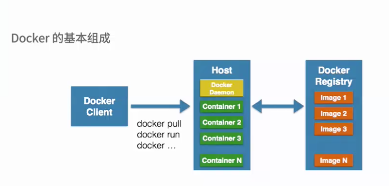
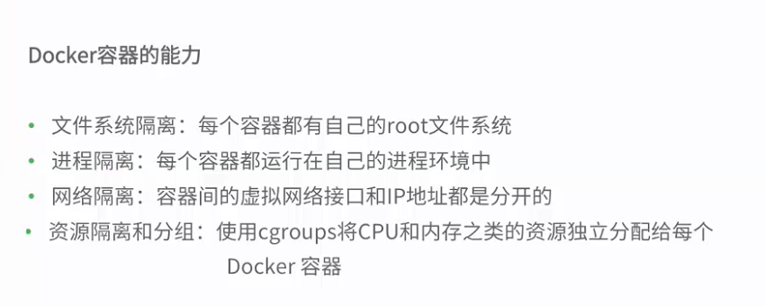
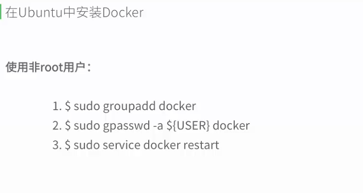
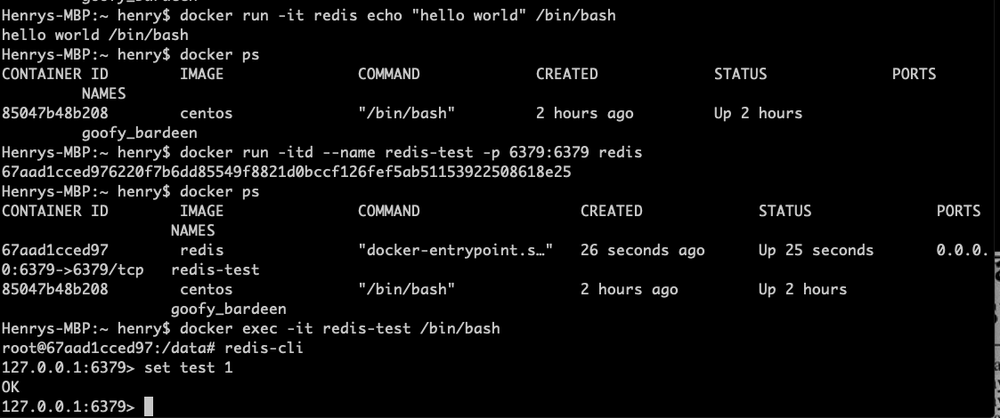

<!-- TOC -->

- [Basic](#basic)
  - [镜像](#%e9%95%9c%e5%83%8f)
  - [容器](#%e5%ae%b9%e5%99%a8)
  - [仓库](#%e4%bb%93%e5%ba%93)
  - [Docker 命令](#docker-%e5%91%bd%e4%bb%a4)
  - [Docker 实例](#docker-%e5%ae%9e%e4%be%8b)
    - [docker 安装 Redis](#docker-%e5%ae%89%e8%a3%85-redis)
      - [运行](#%e8%bf%90%e8%a1%8c)
      - [安装成功](#%e5%ae%89%e8%a3%85%e6%88%90%e5%8a%9f)
    - [docker 安装 MySQL](#docker-%e5%ae%89%e8%a3%85-mysql)
    - [启动MySQL](#%e5%90%af%e5%8a%a8mysql)
- [Develop with Docker](#develop-with-docker)
  - [Build images](#build-images)
    - [Dockerfile best practice](#dockerfile-best-practice)
    - [Create ephemeral containers](#create-ephemeral-containers)
- [Run your application in production](#run-your-application-in-production)
  - [Orchestration](#orchestration)
    - [Enable Kubernetes](#enable-kubernetes)
  - [Configure all objects](#configure-all-objects)
  - [Manage labels on objects](#manage-labels-on-objects)
- [Control Docker with systemd](#control-docker-with-systemd)
    - [HTTP/HTTPS proxy](#httphttps-proxy)
- [Dockerfile reference](#dockerfile-reference)

<!-- /TOC -->
# Basic


使用docker的目的


使用场景





**什么是镜像**？  
Docker 包括三个基本概念
* 镜像（Image）
* 容器（Container）
* 仓库（Repository）

**Docker 容器**

docker 使用容器来运行
- docker 不用root命令



## 镜像
- docker 启动CentOS  
`docker run -t -i centos  /bin/bash`

- 存出和载入镜像  
`docker save `
- 载入镜像  
`docker load`
## 容器
- 导出和导入容器  
`docker export 7691a814370e > ubuntu.tar`
- 导入容器  
`docker import  `

## 仓库  
`docker run -d -p 5000:5000 registry`

## Docker 命令
- 查看版本  
`docker --version`

- 查看所有容器  
`$ docker ps -a`

- 后台运行  
通过加参数d  
`docker run -itd --name ubuntu-test ubuntu /bin/bash`
- 进入容器  
推荐使用exec，容器不会退出
    - docekr attach
    - docker exec  
      `docker exec -it redis-test /bin/bash` 在一个已经启动的容器里运行bash进程 
- 删除容器  
`docker rm name`  
- Docker inspect 命令  
`docker inspect centos`

- 查看完整镜像ID  
`docker images --no-trunc`

- 删除镜像  
`docker rmi 7df` 

- 创建镜像   
`docker commit -a "henry centos" -m "golang" centos henry/centos`

- 启动创建的镜像  
`docker run -d --name henrycentos -p 80 henry/centos nginx -g "daemon off;"`

- dockerfile 创建镜像  
    ```shell
    #First Dockerfile
    FROM ubuntu:14.04
    MAINTAINER henry "henrytien.hotmail.com"
    RUN apt-get update
    RUN apt-get install -y nginx
    EXPOSE 80
    ```
    `docker build -t='henry/df_test' .`  
    启动  
    `docker run -d --name web -p 80 henry/df_test nginx -g "daemon off;"`

- 查看日志  
`docker logs -tf --tail 10 redis-test`
- 查看进程  
`docker top redis-test`

- 启动具体进程  
`docker exec centos nginx`
    ```shell
    Henrys-MBP:~ henry$ docker exec centos nginx
    Henrys-MBP:~ henry$ docker centos top
    docker: 'centos' is not a docker command.
    See 'docker --help'
    Henrys-MBP:~ henry$ docker top 29
    PID                 USER                TIME                COMMAND
    6448                root                0:00                /bin/bash
    6537                root                0:00                nginx: master process nginx
    6538                998                 0:00                nginx: worker process
    6539                998                 0:00                nginx: worker process
    6540                998                 0:00                nginx: worker process
    6541                998                 0:00                nginx: worker process
    6542                998                 0:00                nginx: worker process
    6543                998                 0:00                nginx: worker process

    ```
## Docker 实例
### docker 安装 Redis  
`docker pull redis:latest`

#### 运行
`docker run -itd --name redis-test -p 6379:6379 redis`

#### 安装成功


### docker 安装 MySQL
`docker run -itd --name mysql -p 3306:3306 -e MYSQL_ROOT_PASSWORD=123456 mysql`

### 启动MySQL

`docker exec -it mysql /bin/bash`

# Develop with Docker

## Build images

### Dockerfile best practice

Docker builds images automatically by reading the instructions from a `Dockerfile` -- a text file that contains all commands, in order, needed to build a given image. A `Dockerfile` adheres to a specific format and set of instructions which you can find at [Dockerfile reference](https://docs.docker.com/engine/reference/builder/).

### Create ephemeral containers

### Build images with BuildKit

Docker Build is one of the most used features of the Docker Engine - users ranging from developers, build teams, and release teams all use Docker Build.


# Run your application in production

## Orchestration

The portability and reproducibility of a containerized process mean we have an opportunity to move and scale our containerized applications across clouds and datacenters. Containers effectively guarantee that those applications run the same way anywhere, allowing us to quickly and easily take advantage of all these environments.

Furthermore, as we scale our applications up, we’ll want some tooling to help automate the maintenance of those applications, able to replace failed containers automatically, and manage the rollout of updates and reconfigurations of those containers during their lifecycle.

Tools to manage, scale, and maintain containerized applications are called *orchestrators*, and the most common examples of these are *Kubernetes* and *Docker Swarm*. Development environment deployments of both of these orchestrators are provided by Docker Desktop, which we’ll use throughout this guide to create our first orchestrated, containerized application.

### Enable Kubernetes

Docker Desktop will set up Kubernetes for you quickly and easily. Follow the setup and validation instructions appropriate for your operating system:

[Enable Kubernetes](https://docs.docker.com/get-started/orchestration/#enable-kubernetes)  

## Configure all objects

## Manage labels on objects

Each type of object with support for labels has mechanisms for adding and managing them and using them as they relate to that type of object. These links provide a good place to start learning about how you can use labels in your Docker deployments.

Labels on images, containers, local daemons, volumes, and networks are static for the lifetime of the object. To change these labels you must recreate the object. Labels on swarm nodes and services can be updated dynamically.

[Manage labels on objects](https://docs.docker.com/config/labels-custom-metadata/#manage-labels-on-objects)

# Control Docker with systemd

Many Linux distributions use systemd to start the Docker daemon. This document shows a few examples of how to customize Docker’s settings.

### HTTP/HTTPS proxy

The Docker daemon uses the `HTTP_PROXY`, `HTTPS_PROXY`, and `NO_PROXY` environmental variables in its start-up environment to configure HTTP or HTTPS proxy behavior. You cannot configure these environment variables using the `daemon.json` file.

This example overrides the default `docker.service` file.

If you are behind an HTTP or HTTPS proxy server, for example in corporate settings, you need to add this configuration in the Docker systemd service file.

[HTTP/HTTPS proxy](https://docs.docker.com/config/daemon/systemd/#httphttps-proxy) 

# Command-line reference

## Docker CLI (docker)

### docker build

Build an image from a Dockerfile

```none
docker build [OPTIONS] PATH | URL | -
```

The `docker build` command builds Docker images from a Dockerfile and a “context”. A build’s context is the set of files located in the specified `PATH` or `URL`. The build process can refer to any of the files in the context. For example, your build can use a [*COPY*](https://docs.docker.com/engine/reference/builder/#copy) instruction to reference a file in the context.

The `URL` parameter can refer to three kinds of resources: Git repositories, pre-packaged tarball contexts and plain text files.

- ### Git repositories

Git URLs accept context configuration in their fragment section, separated by a colon `:`. The first part represents the reference that Git will check out, and can be either a branch, a tag, or a remote reference. The second part represents a subdirectory inside the repository that will be used as a build context.

For example, run this command to use a directory called `docker` in the branch `container`:

```
$ docker build https://github.com/docker/rootfs.git#container:docker
```

# Dockerfile reference

Docker can build images automatically by reading the instructions from a `Dockerfile`. A `Dockerfile` is a text document that contains all the commands a user could call on the command line to assemble an image. Using `docker build` users can create an automated build that executes several command-line instructions in succession.

This page describes the commands you can use in a `Dockerfile`. When you are done reading this page, refer to the [`Dockerfile` Best Practices](https://docs.docker.com/engine/userguide/eng-image/dockerfile_best-practices/) for a tip-oriented guide.


